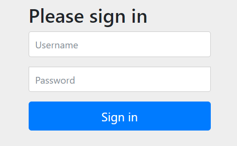
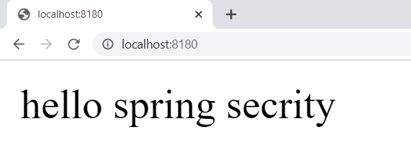

# Simple spring security
This is simple spring security with default configuration

Run application
---------------

for running the app from console run below command:

    mvnw spring-boot:run
or if you have maven installed on your machine:

    mvn spring-boot:run
   
open http://localhost:8180

You should see this:

  

login
-----
To login for the app use below credential:

    login: user
    password: password
    
 it will looks like this:
 
  
